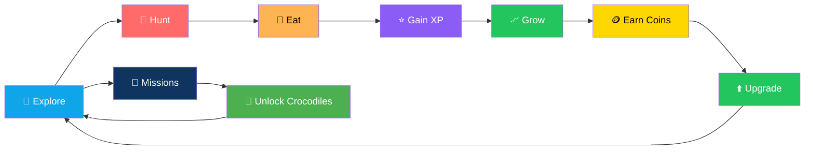
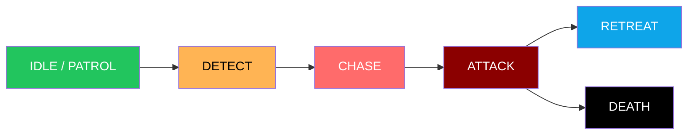

# 🐊 Hungry Crocodile

<div align="center">


**An open-world river survival game.**

*Hunt · Grow · Survive · Become the apex predator*

[✨ Overview](#-overview) • [🎮 Gameplay](#-gameplay) • [🐊 Crocodiles](#-crocodile-system) • [🌍 World](#-world-zones) • [🚀 Running Locally](#-running-locally)

</div>

---

## 📖 Overview

**Hungry Crocodile** is an open-world river survival game built with plain HTML5, CSS3, and vanilla JavaScript.

Hunt prey, grow from a hatchling into an ancient apex predator, collect treasure, complete missions, and unlock new crocodiles — all running entirely in the browser with **no build step, no frameworks, and no backend**.

### Core Idea

> **Everything is procedural. Everything runs in the browser.**
>
> No image files. No audio files. No bundler. The whole game is a handful of JavaScript files, ready to deploy as static assets.

### The Core Loop



---

## ✨ Features

<div align="center">

| 🌍 Large Scrolling World | 🗺️ Six Distinct Zones |
|:---:|:---:|
| 8000 × 4500 with a smooth follow camera | Each with unique water colors, creatures, and danger levels |
| **🐊 Six Playable Crocodiles** | **🧠 Living AI Ecosystem** |
| Unique stats and a special ability each | Fish school, birds flee, predators patrol/chase/retreat |
| **⛓️ Size-Based Food Chain** | **📈 50-Level Progression** |
| You cannot eat everything immediately | Your crocodile visibly scales as you level up |
| **🌊 Diving System** | **🌦️ Dynamic Weather & Time** |
| Oxygen meter adds risk to treasure hunting | Clear · Rain · Heavy rain · Fog · Storm · Full day/night cycle |
| **💰 Economy & Missions** | **🏆 Achievements & Stats** |
| Coins, gems, treasure in four rarities | Six achievements and persistent lifetime statistics |
| **🛍️ Shop System** | **🔊 Procedural Audio** |
| Crocodiles, stat upgrades, and cosmetic skins | All sound synthesized via Web Audio API — no files |
| **💾 Robust Save System** | **📱 Full Mobile Support** |
| LocalStorage with in-memory fallback | Virtual joystick and touch buttons |

</div>

### Detailed Feature List

- **Large scrolling world** — 8000 × 4500 with a smooth follow camera
- **Six hand-tuned zones** — each with its own water colors, creatures, and danger levels
- **Six playable crocodiles** — each with unique stats and a special ability
- **Living AI ecosystem** — fish school and scatter, birds flee, predators patrol / chase / retreat
- **Size-based food chain** — you cannot eat everything immediately
- **50-level size progression** — visibly scales your crocodile
- **Diving with an oxygen meter**
- **Dynamic weather** — clear, rain, heavy rain, fog, storm — and a **full day/night cycle**
- **Treasure in four rarities**, missions, achievements, and persistent statistics
- **Shop** — crocodiles, stat upgrades, ability info, and cosmetic skins
- **Procedurally synthesized audio** via the Web Audio API *(no audio files)*
- **LocalStorage save system** with a safe in-memory fallback
- **Full desktop and mobile support** — including a virtual joystick

---

## 🎮 Gameplay

### Getting Started

Start in the **Shallow River**, where small fish, frogs, and ducks are easy prey. Eating grants XP and coins.

As your level rises:

- Your crocodile **physically grows**
- You gain **health**, **bite damage**, and **a little speed**
- Larger prey becomes edible
- Tougher zones become survivable

### Danger System

Travel east and the river turns hostile:

- **Rival crocodiles**, **patrol boats**, and **ancient predators** will chase you if you're small enough to be worth attacking
- When something far larger is nearby, you'll see a **⚠️ TOO DANGEROUS** warning — **treat it as a cue to leave**

### Health & Oxygen

- **Health regenerates only through eating** — staying fed is staying alive
- **Diving** reveals deeper areas and treasure but **drains oxygen**
- Surface before it runs out, or you start taking damage

---

## 🕹️ Controls

### Desktop

| Key | Action |
|-----|--------|
| `W` / `↑` | Swim forward |
| `S` / `↓` | Dive |
| `A` / `←` | Turn left |
| `D` / `→` | Turn right |
| `SPACE` | Boost |
| `E` | Bite / attack |
| `Q` or `Shift` | Special ability |
| `P` | Pause / resume |
| `M` | Mute sound effects |
| `R` | Restart run |

### Mobile

| Control | Position | Action |
|---------|----------|--------|
| **Virtual joystick** | Left | Push up to swim, down to dive, left/right to turn |
| **POWER** button | Right | Special ability |
| **BOOST** button | Right | Speed boost |
| **BITE** button | Right | Attack |

> 📱 **Page scrolling and rubber-banding are suppressed** while a run is active.

---

## 🐊 Crocodile System

| Crocodile | Cost | Profile | Ability |
|-----------|-----:|---------|---------|
| **Swamp Croc** | Free | Balanced all-rounder | Bite Frenzy |
| **River Croc** | 800 | Fast, fragile | River Dash |
| **Armored Croc** | 1,800 | Tanky, slower | Thick Hide |
| **Hunter Croc** | 3,200 | High bite damage | Mega Bite |
| **Black Croc** | 6,000 | Fast and stealthy | Ambush |
| **Ancient Croc** | 15,000 | Legendary end-game | Whirlpool |

Every ability has a **cooldown**, **duration**, **visual effect**, **sound**, and **HUD ring indicator**.

### Abilities Explained

| Ability | Effect |
|---------|--------|
| **Bite Frenzy** | Attack speed increase |
| **River Dash** | Extreme forward burst |
| **Thick Hide** | Reduces incoming damage |
| **Mega Bite** | A single devastating strike |
| **Ambush** | Prey and predators struggle to detect you |
| **Whirlpool** | Drags nearby small prey toward you |

---

## 🧠 Ecosystem

Creatures run **real behavior state machines** rather than moving randomly.

| Creature Type | Behavior |
|--------------|----------|
| **Fish** | Drift in loose schools, flee when you're large enough to threaten them |
| **Birds / ducks** | Bob near the surface and scatter as you approach |
| **Land animals** *(boars, deer, monkeys, jungle cats)* | Wander near the banks and flee when threatened |
| **Snakes** | Sinuous swimming motion, quick to escape |
| **Humans** | Fishermen work the docks and panic-run when attacked *(cartoon-safe, no graphic content)* |
| **Boats** | Fishing boats, speedboats, cargo ships, and dangerous patrol boats |
| **Predators** | Patrol territory, detect you, chase if they outmatch you, retreat when badly hurt |

---

## 🌍 World Zones

| # | Zone | Danger | Highlights |
|:-:|------|:------:|-----------|
| 1 | **Shallow River** | ★ | Small fish, frogs, ducks, small birds |
| 2 | **Marshlands** | ★★ | Large fish, turtles, boars, snakes |
| 3 | **Jungle River** | ★★★ | Monkeys, deer, jungle cats |
| 4 | **Fishing Village** | ★★★ | Fishermen, docks, boats, treasure |
| 5 | **Deep River** | ★★★★ | Giant fish, rival crocs, patrol boats |
| 6 | **Ancient Swamp** | ★★★★★ | Giant snakes, ancient predators, the **Giant Catfish boss** |

---

## ⚔️ Combat

### Bite Mechanics

- Bites are **range-checked** against the nearest entity
- Damage scales with:
  - **Level**
  - **Crocodile type**
  - **Jaw Strength** upgrade
  - **Active ability**
- **Creatures far larger than you only take chip damage** — you need to grow before they become edible

### Enemy State Machine



> 💡 **Tiny prey are eaten automatically on contact** — this keeps the early game fast and satisfying.

---

## 📜 Missions

**Three missions are active at a time** and refill automatically as you complete them.

- Progress is tracked **live in the HUD**
- Progress **persists between sessions**

**Examples:**

- Eat 25 fish
- Collect 10 treasure chests
- Survive 5 minutes
- Destroy 5 boats
- Reach the Ancient Swamp
- Defeat the Giant Catfish

---

## 🏆 Achievements

**Six achievements, saved permanently:**

| Achievement | Requirement |
|-------------|-------------|
| **First Bite** | Eat your first prey |
| **Fisherman's Nightmare** | Attack fishermen |
| **Big Boy** | Reach level 10 |
| **Apex Predator** | Become the top of the food chain |
| **Treasure Hunter** | Collect 25 chests |
| **River King** | Reach max level |

---

## 💰 Economy

<div align="center">

| 🪙 Coins | 💎 Gems |
|:---:|:---:|
| Earned from every kill, treasure chest, level-up, and mission | A premium counter tracked and displayed in the HUD and shop |
| **📦 Treasure** | **🛍️ Shop** |
| Common · Rare · Epic · Legendary chests scattered across the map | Spend coins on new crocodiles, stat upgrades, and cosmetic skins |

</div>

### Shop Categories

- **New crocodiles** — unlock the roster
- **Stat upgrades:**
  - Vitality
  - Swiftness
  - Jaw Strength
- **Cosmetic skins** — change your crocodile's look

> 💡 **Purchases are blocked with a clear message** when you can't afford them.

---

## 💾 Save System

Progress is written to **LocalStorage** under the key **`hungry_crocodile_save_v1`** after every meaningful event.

### What's Saved

- Level and XP
- Coins and gems
- Unlocked and equipped crocodiles
- Upgrades and skins
- Missions and achievements
- Lifetime statistics
- Settings

### Fallback Behavior

If LocalStorage is unavailable *(private browsing, blocked cookies, `file://` restrictions in some browsers)*:

1. The game **detects it at startup**
2. Logs a **warning**
3. **Transparently falls back to in-memory storage** — so play is never interrupted

> 💡 **Saves are merged against defaults on load** — so older saves keep working after updates.

### Reset Progress

Lives in **Settings** and **asks for confirmation**.

---

## 🛠️ Technology

| Layer | Technology |
|-------|-----------|
| **Structure** | HTML5 |
| **Styling** | CSS3 |
| **Logic** | Vanilla JavaScript *(ES5-compatible syntax, no modules, no transpiler)* |
| **Rendering** | HTML5 Canvas 2D |
| **Audio** | Web Audio API *(fully synthesized)* |
| **Persistence** | LocalStorage |

> 🚫 **No frameworks, no game engine, no bundler, no backend, no external assets.**

---

## 📁 Project Structure

```
hungry-crocodile/
├── index.html
├── README.md
├── LICENSE
├── .gitignore
│
├── css/
│   ├── style.css          Base layout, menus, buttons
│   ├── game.css           HUD, joystick, banners
│   └── responsive.css     Mobile/tablet/landscape adaptations
│
├── js/
│   ├── main.js            Bootstrap
│   ├── game.js            Core Game class, loop, combat, rendering
│   ├── config.js          All tunable game data
│   ├── player/            crocodile.js, crocodileTypes.js, abilities.js
│   ├── world/             world.js, river.js, zones.js, camera.js, environment.js
│   ├── entities/          fish, birds, animals, predators, boats, humans
│   ├── systems/           ai, collision, spawning, particles, progression, missions, saveSystem
│   ├── ui/                hud, menus, shop, notifications
│   ├── audio/             audio.js
│   └── input/             input.js
│
├── assets/
│   ├── images/            (empty — all art is procedural)
│   └── audio/             (empty — all audio is synthesized)
│
└── screenshots/
```

> 💡 **The `assets/` folders are intentionally empty** — every visual is drawn procedurally and every sound is synthesized.

---

## 🚀 Installation

**No installation or build step is required.**

```bash
git clone https://github.com/your-username/hungry-crocodile.git
cd hungry-crocodile
```

---

## ▶️ Running Locally

Because the game loads several `.js` files, some browsers restrict `file://` access. Opening `index.html` directly usually works, but **serving it over HTTP is the reliable option**.

### Python 3 *(already installed on most systems)*

```bash
python3 -m http.server 8000
```

### Node.js

```bash
npx serve .
```

### VS Code

1. Install the **Live Server** extension
2. Right-click `index.html`
3. Choose **Open with Live Server**

### Then

Open **http://localhost:8000** and click **"Tap to start 🐊"** to enable audio.

> 💡 **Browsers require a user gesture before sound can play.**

---

## 🚢 Deployment

The game is a **fully static site** — upload the folder as-is.

### GitHub Pages

1. Push the project to a GitHub repository
2. Go to **Settings → Pages**
3. Under **Source**, choose the `main` branch and the `/ (root)` folder
4. Save

Your game will be live at `https://your-username.github.io/hungry-crocodile/`.

### Vercel

```bash
npm i -g vercel
vercel
```

Accept the defaults. When asked for a build command, **leave it empty**; set the output directory to the **project root**.

### Netlify

**Drag and drop:**

Drag the project folder onto [app.netlify.com/drop](https://app.netlify.com/drop).

**Or via CLI:**

```bash
npm i -g netlify-cli
netlify deploy --prod --dir .
```

---

## 📱 Mobile Support

The HUD, menus, and controls adapt via media queries in `responsive.css`.

### Touch Controls

Touch controls appear automatically on devices matching:

```css
(hover: none) and (pointer: coarse)
```

…and are **hidden on mouse-driven devices**.

### Mobile Optimizations

- **Canvas scales to `devicePixelRatio`** *(capped at 2)* for crisp rendering on high-DPI screens
- **Portrait and landscape layouts** both supported, with a compact HUD in short landscape viewports
- **Page scrolling and pull-to-refresh are blocked** during gameplay
- **Buttons are sized for comfortable thumb reach**

---

## ⚡ Performance

<div align="center">

| Technique | Details |
|-----------|---------|
| **Delta-time movement** | `requestAnimationFrame` with delta-time clamped to **50 ms** to survive tab switches |
| **Fixed particle pool** | 400 objects — **no allocation during play** |
| **Entity culling** | Entities beyond **2200 px** from the player are culled and capped at **55 active** |
| **Rate-limited spawning** | Distance-limited and rate-limited |
| **Skip off-screen drawing** | Off-screen entities, props, treasures, and particles skip drawing entirely |
| **Single depth sort** | Entities are depth-sorted only **once per frame** |

</div>

The game targets **60 FPS** and remains playable on lower-end hardware.

> 💡 **Dropping Quality to Low in Settings, or turning particles off, reclaims additional headroom.**

---

## 🎨 Customization

Nearly all tuning lives in **`js/config.js`**.

| What to Change | Where |
|---------------|-------|
| World size | `WORLD_WIDTH`, `WORLD_HEIGHT` |
| Level pacing | `XP_BASE`, `XP_EXP`, `MAX_LEVEL` |
| Crocodile sizes per tier | `LEVEL_TITLES` |
| Zones, colors, spawn tables | `ZONES` |
| Crocodile stats and abilities | `CROCODILE_TYPES`, `ABILITIES` |
| Creature stats | `PREY`, `PREDATORS` |
| Missions and achievements | `MISSIONS_POOL`, `ACHIEVEMENTS` |
| Oxygen and diving | `OXYGEN_*`, `DIVE_DEPTH_MAX` |

### Adding a New Creature

**Three steps:**

1. Add a **stat block** to `PREY`
2. Register a **factory** and a **draw function** in the relevant `js/entities/*.js` file
3. List its id in a zone's **`spawns` array**

---

## ⚙️ Configuration

Runtime options are in **Settings** and persist automatically.

| Setting | Effect |
|---------|--------|
| **Sound** | Toggles sound effects |
| **Music** | Toggles the ambient river drone |
| **Particles** | Disables the particle system entirely |
| **Screen Shake** | Removes camera shake on impacts |
| **Quality** | Low / Medium / High rendering profile |

---

## 🔧 Troubleshooting

### 🔊 No Sound

- Browsers block audio until you interact with the page — **click the "Tap to start" overlay**
- Check **Sound/Music** in Settings
- Make sure `M` hasn't muted effects

### 💾 Progress Isn't Saving

LocalStorage may be blocked by private browsing or cookie settings. The game **falls back to memory** and logs a warning to the console — progress will then last only for the session.

### ⬛ Blank Screen or Scripts Not Loading

**Serve the folder over HTTP** rather than opening `index.html` from the filesystem. Check the browser console for the failing path.

### 📱 Touch Controls Missing on a Touchscreen Laptop

Controls key off `(hover: none) and (pointer: coarse)`. **Hybrid devices reporting a fine pointer will show the desktop scheme** — keyboard controls still work.

### 🐢 Low Frame Rate

- Turn **particles off**
- Set **Quality to Low**
- Close other heavy tabs

### 🔤 Fonts Look Generic Offline

The stylesheet pulls **Baloo 2** and **Nunito** from Google Fonts. Without a connection, the browser falls back to **system sans-serif**. **Gameplay is unaffected.**

---

## 🗺️ Roadmap

### ✅ Current

- [x] Large scrolling world with smooth follow camera
- [x] Six hand-tuned zones with unique creatures
- [x] Six playable crocodiles with special abilities
- [x] Living AI ecosystem with behavior state machines
- [x] Size-based food chain
- [x] 50-level size progression with visual scaling
- [x] Diving with oxygen meter
- [x] Dynamic weather and day/night cycle
- [x] Treasure in four rarities
- [x] Three rotating missions with persistence
- [x] Six permanent achievements
- [x] Shop with crocodiles, upgrades, and skins
- [x] Fully synthesized Web Audio sound
- [x] LocalStorage save with in-memory fallback
- [x] Full desktop and mobile support with virtual joystick
- [x] Fixed-pool particle system
- [x] Entity culling and rate-limited spawning

### 🔜 Future Ideas

- [ ] Additional boss encounters per zone
- [ ] Persistent world treasure locations rather than proximity spawning
- [ ] Pack AI so predators coordinate
- [ ] Underwater cave interiors as separate sub-areas
- [ ] Gem-based premium purchases and daily challenges
- [ ] Gamepad support
- [ ] Replay/highlight capture

---

## 🤝 Contributing

Contributions are welcome. Please:

1. Fork the repository
2. **Keep it build-free** — no bundlers, no frameworks, no modules
3. **Keep it procedural** — no external assets
4. **Preserve the fixed-pool particle system** — no allocation during play
5. **Preserve the in-memory fallback** — the game must never crash if LocalStorage is unavailable
6. Test on both desktop and mobile
7. Submit a Pull Request

### Guidelines

- **Never add a required external dependency** beyond Google Fonts
- **Never ship copyrighted assets** — everything must be generated in code
- **Never block the main thread** — keep the frame budget under 16 ms
- **Never break the size-based food chain** — progression depends on it
- **Preserve accessibility** — keyboard and touch must both work

---

## 📜 License

Released under the **MIT License**. See [LICENSE](LICENSE).

> 🎨 **All artwork, animation, and audio are generated procedurally in code and are original to this project.**
>
> **No assets, characters, logos, or sounds from any commercial game are used.**

---

## 🙏 Acknowledgments

- **HTML5 Canvas** — for making procedural art this satisfying
- **Web Audio API** — for a game with zero audio files
- **Every river that's ever hidden something beneath the surface** — this is for you

---

<div align="center">

### 🐊 HUNT. GROW. DOMINATE.

**The river remembers everything. Become what it fears.**

**No frameworks. No backend. No external assets.**

<br>

⭐ If you enjoyed this game, consider giving it a star.

<br>

[⬆ Back to Top](#-hungry-crocodile)

</div>
